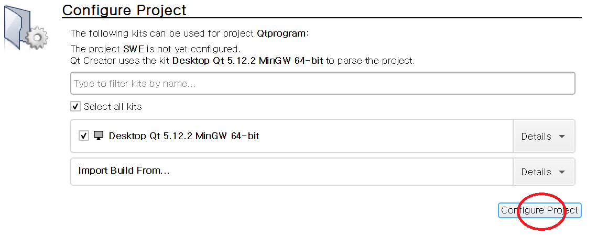

# 윷놀이 Application  


- 윷놀이 게임이란 **윷판**과 4개의 **윷**을 이용한 일종의 보드게임으로 한국의 전통놀이다. 4개의 **윷**을 던지면 던져진 모양에 따라 **도, 개, 걸, 윷, 모, 빽도**와 같이 총 5가지의 결과가 나오는데 이에 따라 말을 움직이며 한 팀에 배정된 모든 말을 도착지점까지 도달시키면 승자가 된다. 사용자는 본 시스템을 이용하여 **윷판**과 **윷**이 없더라도 윷놀이 게임을 즐길 수 있다.   


## 설치 방법(Installation)    

- 해당 프로젝트는 QT 프레임워크를 이용한다.

- 사이트로 접속하여, 다운로드 페이지로 이동하여 Open Source 버전을 다운받는다.

  다운로드 사이트: <https://www.qt.io/>   


- QT를 다운받은 후, Repository를 clone한다.   

```
git clone https://github.com/aabbo/Qtprogram.git  
```


- clone한 폴더에 들어가서 **SWE**라는 이름의 QT Project file을 클릭한다.

- 아래 그림과 같이 **Configure**를 해주고 프로그램을 **Run**하면 실행된다.  
  

### 빌드 없이 실행하고자 하는 경우
- 이미 빌드된 결과물을 활용하는 방법이다.
- github repository내에 ExecutableFile 폴더에 최근 버그가 수정된 실행 가능한 파일이 존재한다. 
해당 폴더를 전부 받아서 별다른 수정을 거치지 않고, 폴더 내의 SWE.exe파일을 실행시키면 프로그램 실행이 가능하다. 
- 개인적으로 본 프로젝트를 빌드할 시, 릴리즈 빌드 결과물 중 exe파일을 ExecutableFile 폴더 내부로 복사하면 최신 버전을 추가로 빌드 없이 사용할 수 있다.


## 사용 방법 (Usage)  


1. 플레이어는 참여자의 **인원수**(2\~4)와 **게임 말 개수**(2\~5)를 슬라이드바를 이용해 조절하여 선택할 수 있다.

2. 게임 시작을 원한다면 **시작**버튼을 클릭한다.

3. 플레이어는 순서에 맞추어  돌아가면서 게임을 진행한다.

   윷은 **랜덤**이나 **지정** 윷 던지기 버튼을 클릭하여 윷을 던질 수 있다.

   (던진 윷에 대한 결과는 우측 상단에서 확인 가능하다.)

4. 이동 가능한 말 중 플레이어가 **이동할 말**을 클릭한다.

5. 클릭한 말이 이동 가능한 위치가 보드에 **검은색 라인으로 하이라이팅**된다.

6. 하이라이팅된 위치 중 **이동할 위치**를 클릭한다.

7. 말이 해당 위치로 이동하여 보드에 나타난다.


   (**특징** : 잡기와 업기 기능이 구현되어있다.)  

   ***3 ~ 7의 과정이 게임이 종료될 때까지 반복된다.***

8. 한 플레이어의 모든 말이 보드 밖으로 탈출한 경우 해당 플레이어가 **승리**한다.

9. 승리한 플레이어의 정보를 띄우고 재시작을 하고 싶다면 **재시작** 버튼을,

   종료를 원한다면 **종료** 버튼을 클릭하여 게임을 종료한다.
